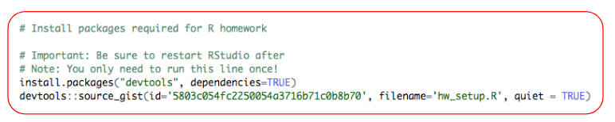
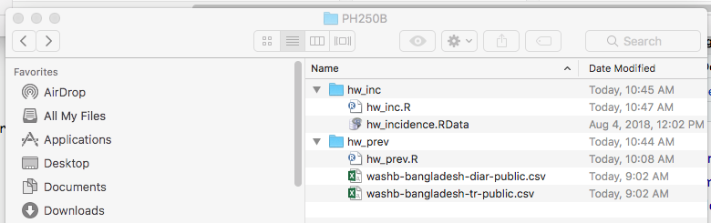
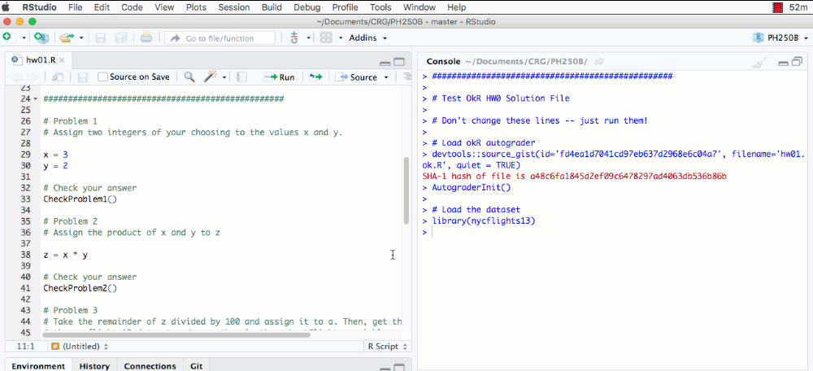

```{r setup, include=FALSE}
library(learnr)
library(png)
library(knitr)
knitr::opts_chunk$set(echo = FALSE)
```


## Overview 

### How homework works 
To ensure that you gain experience working in R "from scratch"" we have created homework assignments that you will complete on your own computer using RStudio, a free interactive environment that we recommend for coding R.

1. Setup Rstudio on your desktop
2. Download homework assignment from the [R-for-epi site](https://ucb-epi-r.github.io/R-for-epi/)
3. Save the homework and any data files in the homework zip file to your computer
4. Complete the homework assignment
5. Upload the completed homework assignment to [okpy.org](okpy.org)
6. You will receive your grade via email
7. Check bCourses for solutions to the assignment

### Video overview
This video and the rest of the pages on this site provide step-by-instructions on how to do homework. 
[](https://youtu.be/bAtSXCjrbpk) 

Questions? Contact [Jade Benjamin-Chung](mailto:jadebc@berkeley.edu)

## Setup

In order to complete homework assignments, you will need to download R and RStudio. 

### Install R
To install R, follow either link below: 

- [Download R for Mac](https://cran.r-project.org/bin/macosx/)
- [Download R for PC](https://cran.r-project.org/bin/windows/base/)

### Install RStudio
You can use R itself, but we recommend that you use RStudio, an Interactive Development Environment (IDE) with lots of features that makes R easier to use.

- [Download RStudio](https://www.rstudio.com/products/rstudio/download/)
- See the [Intro to R tutorial](https://jadebc.shinyapps.io/intro-to-R/) for resources on how to use RStudio. 

### Install required packages

You will need to install some R packages in order to complete homework assignments and view downloaded tutorials. Check [here](https://gist.github.com/jadebc-berkeley/5803c054fc2250054a3716b71c0b8b70) for an up-to-date list of required packages.  

To install these packages, you can use the first chunk of code in your first homework assignment (`hw_prev.R`) (see below). You only need to run this code one time. Then restart RStudio before beginning your homework.




## Organizing your files


### Saving your files on your computer
Proper organization of your files will make your coding experience much smoother. We suggest the following:

- Create a folder for the course on your computer. For example: `"~/C:/PH250B/R_homework/"`
- Create separate folders for each homework assignment within the course folder. 
- When you run an R script that reads in data, if the data is located in the same directory as the homework script, you should be able to load the data without modifying the code. For example, in the image above, `hw_inc.R` is in the same folder as `hw_incidence.RData`. In `hw_inc.R`, running the code `load(hw_incidence.RData)` will load the dataset without requiring you to edit the directory name in the R script. 



### Create an RStudio project for each homework assignment
RStudio allows you to create projects that contain a combination of R scripts, datasets, and analysis results all in one place. We recommend that you create a new project for each homework assignment. This makes it easy for R to locate the R script containing the assignment and to load the data associated with that assignment. Complete this step after downloading your homework zip file. It will create a new project with the extension .Rproj. The video below shows you how to do this. 

<!--    -->

<video width="720" controls>
  <source src="www/new_rstudio_project.mp4" type="video/mp4">
</video>

## Using okpy.org

Homework must be submitted through [okpy.org](okpy.org) It will be graded on accuracy as well as style (i.e., how organized the code is). We encourage you to work on these assignments with your classmates. You are likely to learn more by working with each other. Feel free to ask and answer questions and share your ideas with each other. That being said, homework is submitted and graded individually.

- Use the same email address associated with bCourses to log in to [okpy.org](okpy.org). 
- You will be able to see all homework assignments available for the course. 
- When submitting an assignment, do not change the original file name of the homework prior to submission. For example, if the homework assignment is called `hw_prev.R`, submit a file called `hw_prev.R` with your solutions. 
- You do not need to include your name in the script. 

#### How to submit homework on okpy.org: 

[](https://www.youtube.com/watch?v=gO7Pkj51Qy8&feature=youtu.be) 

## Autograding

Each homework has an autograder that allows you to check whether you got the right answer to each problem as you code.

- You must have an internet connection for the autograder to work. 
- The autograder tries to anticipate the mistakes you may have made and will give you a hint if your answer is not correct. 
- As shown below, running code that says `CheckProblem1` will check the result of Problem 1.  You can change the values of `x` and `y` and run `CheckProblem1` again, repeating this process until you get the right answer. 
- Getting a 100% score using the autograder doesn’t guarantee that you will get a 100% score on the assignment. We recommend that you use the autograder as a helpful tool but that you carefully check your code as well to make sure you think it’s right (even if the autograder says so). 

  
  


